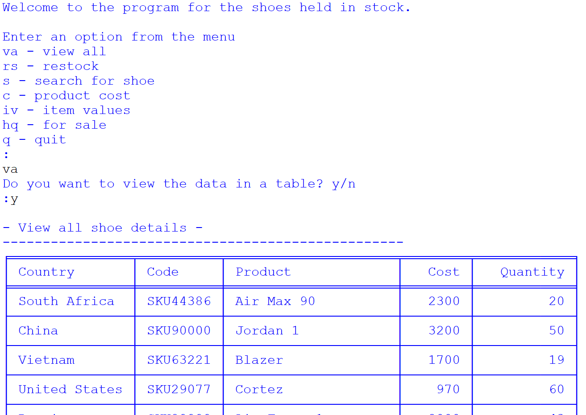
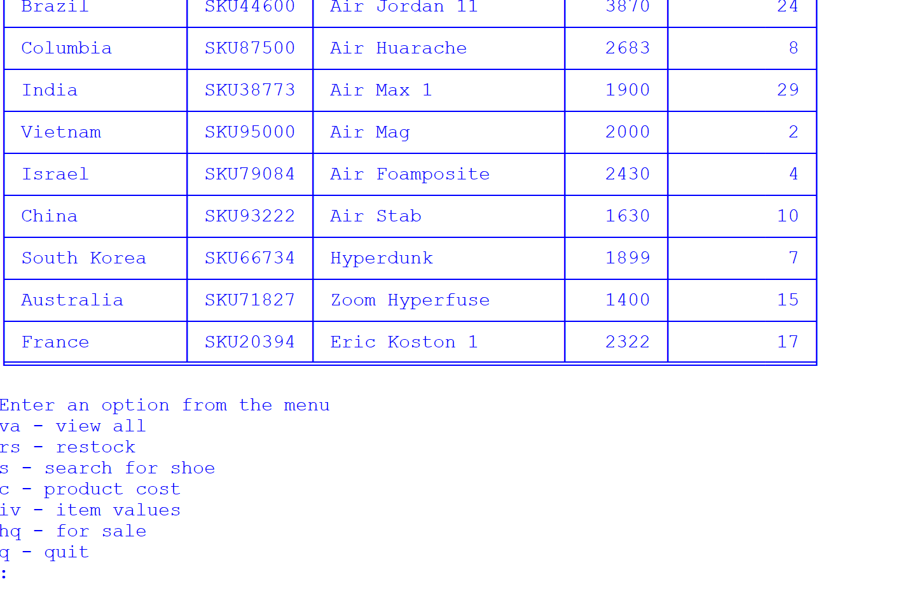
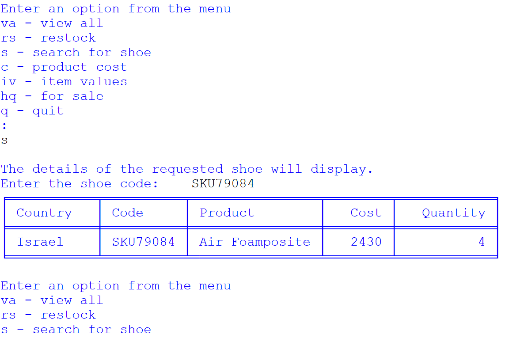
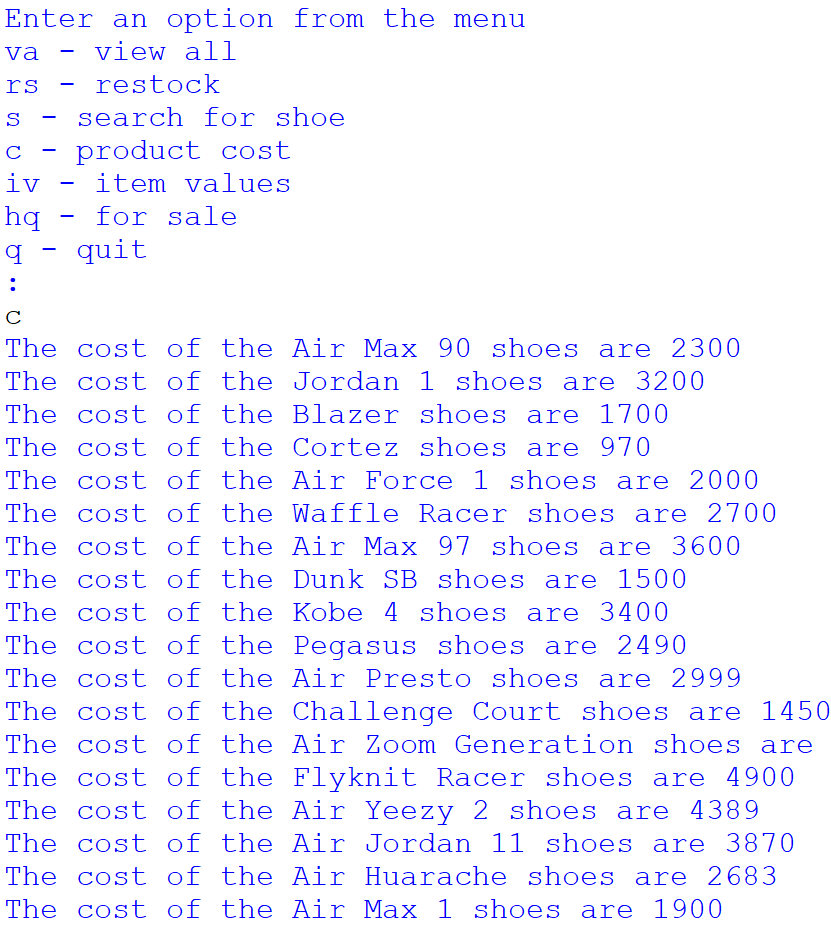
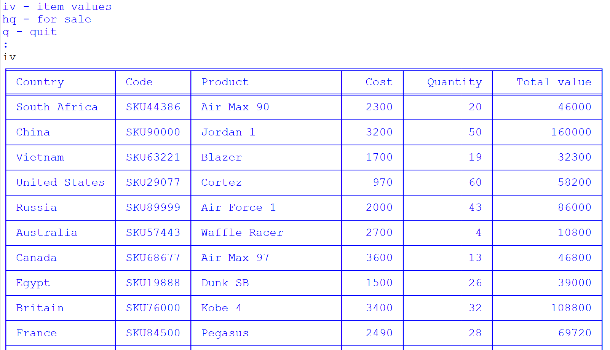
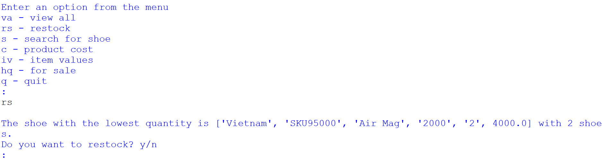
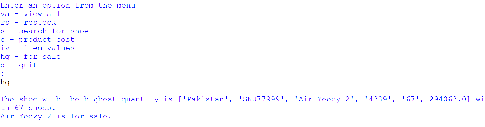
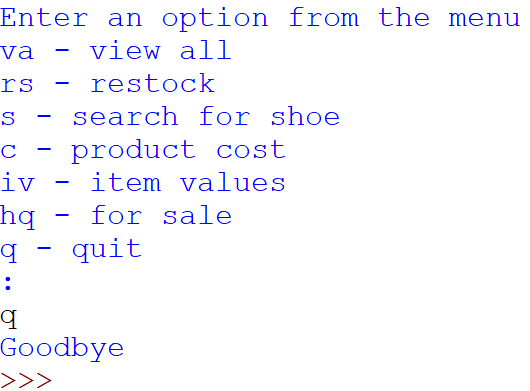

# Project name
Shoe inventory

# Project description

*Importance of the project*

This project focuses on using object-oriented programming to address real-world problems, specifically in the context of Nike warehouses. The importance of this project lies in its ability to enhance the efficiency and organisation of Nike's stock-taking process. By utilising Python programming skills, the project aims to provide an overview of each stock-taking session, helping store managers, particularly the store master, in their role.

The project offers the following key benefits:

1. *Optimised Delivery Time:* It helps optimise delivery time by streamlining the stock-taking process, making it more efficient and organised.

2. *Neat Organisation:* The project promotes neater organisation of warehouse data, ensuring that all stock-taking details are well-structured and easily accessible.

3. *User-Friendly Functionality:* It caters to store managers from various regions, making it easy for them to interact with the program. The functionality includes searching for products by code, identifying low-stock items for restocking, finding high-stock items, and calculating the value of each item based on cost and quantity.

4. *Error-Free Code:* The project emphasises error handling by addressing syntax, runtime, and logical errors in the code, ensuring that it runs smoothly.

5. *Readability:* The code is written to be readable, featuring descriptive variable names, comments for clarity, proper use of whitespace and indentation, and efficient code structure.

6. *Data Presentation:* The project provides easy-to-read and understandable output for the user. It prepares data from a text file and presents it in an organised manner, making it convenient for managers to make informed decisions.

*What the project does*

The project is designed to accomplish several tasks related to Nike's stock-taking process:

1. *Data Management:* It reads data from the text file "inventory.txt" and organises this data to create shoe objects with attributes such as country, code, product, cost, and quantity.

2. *Shoe Class:* The project defines a "Shoe" class with methods to retrieve the cost and quantity of shoes and provide a string representation of a shoe object.

3. *User Interaction:* Users can capture data about a shoe, which is used to create a shoe object and append it to a list of shoe objects.

4. *Data Viewing:* The program allows users to view details of all shoes in the list, presented in a readable format, using Python's "tabulate" module to organise data in a table.

5. *Restocking:* The system identifies shoes with the lowest quantity and offers users the option to add stock. It updates the quantity for these shoes in the data file.

6. *Search Functionality:* Users can search for a specific shoe by its code, and the program returns the corresponding shoe object.

7. *Value Calculation:* The project calculates the total value for each item based on the formula "value = cost * quantity" and displays this information for all shoes.

8. *Highest Quantity:* The program determines the product with the highest quantity, indicating it as available for sale.

9. *Menu-Driven Interface:* All these functionalities are organised in a menu-driven interface, ensuring that users can easily access and use these features.

In summary, this project uses object-oriented programming to enhance the efficiency and organisation of Nike's stock-taking process, providing an accessible and user-friendly solution for store managers across different regions. It ensures data accuracy, readability, and easy data presentation, ultimately benefiting Nike's warehousing operations.

# Installation section
*Tell other users how to install your project locally*

1. Install Python: 
    1. Download Python IDLE 3.7.0 to run the program
    1. Visit the official Python website at https://www.python.org/downloads/windows/ in your web browser.
    1. Click on the "Download Python 3.7.0" button
    1. Under Files section, download the one that matches your system architecture (32-bit or 64-bit). Most modern systems are 64-bit.
    1. Click on the installer to download it.
    1. Locate the downloaded installer file and double-click on it to run the Python installer.
    1. Check the box that says "Add Python 3.7.0 to PATH." 
    1. Click the "Install Now" button to start the installation process.
     
1. Open the Command Prompt (cmd)
    1. Clone repository: `git clone <repository-url>`
    1. Navigate to the project directory: `cd "path\to\inventory.py"`

1. Create a Virtual Environment:
    1. Create a folder for new virtual env: `mkdir Virtual_env`
    1. Navigate to folder: `cd Virtual_env`
    1. Create a virtual environment: `virtualenv inventory`

1. Activate the Virtual Environment:
    + In Windows Command Prompt (Admin):
    1. In your Virtual_env folder there will be a folder called Scripts. Copy its path.
    1. Change directory to Scripts `cd "path\to\scripts\in\virtual\environment"`
    1. Activate virtual environment: `activate.bat`
    1. You will see (bookshelfvenv) at the start of cmd line
    1. change directory to app root directory: `cd "path\to\app"`

1. Verify Python installation: `python --version`
1. Verify pip installation: `pip --version`
1. Install the dependencies: `pip install -r requirements.txt`    

# Usage section
*Instruct others on how to use your project after they’ve installed it*

*Outline the steps necessary to build and run your application with venv and Docker:*
+ Activate virtual environment [see above]

+ Install Docker desktop @ https://www.docker.com/products/docker-desktop
+ Open Docker Desktop
+ login to Docker Hub @ https://hub.docker.com/

## Use the Command Prompt
1. Check that Docker desktop was successfully installed: `docker run hello-world`
1. Build the docker image: `docker build -t inventory .` 
1. Run the docker image: `docker run -it inventory`
1. Deactivate the Virtual Environment: `deactivate`

## Use Docker Playground
1. Follow: https://labs.play-with-docker.com/
1. Start a new instance

In the terminal: 
1. Copy command from Docker Hub @ https://hub.docker.com/repository/docker/kcse1/inventory/tags?page=1&ordering=last_updated: `docker pull kcse1/inventory:shoe`
1. Run the docker image: `docker run -it kcse1/inventory:shoe`
1. Close session on Docker Playground

## Use Python IDLE
Run the program (F5) and select an option from the menu

1. Deactivate virtual environment in cmd when you are done working: `deactivate`

*Include screenshots of your project in action*

# Credits
*highlights and links to the authors of your project if the project has been created by more than one person*

@KC-software-en

# Add a URL to your GitHub repository

https://github.com/KC-software-en/automatic-succotash

